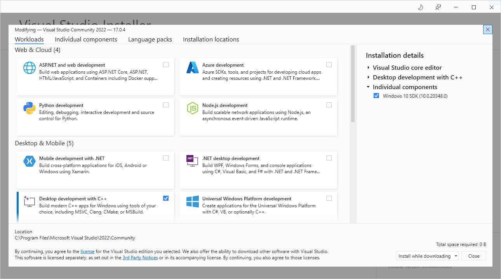
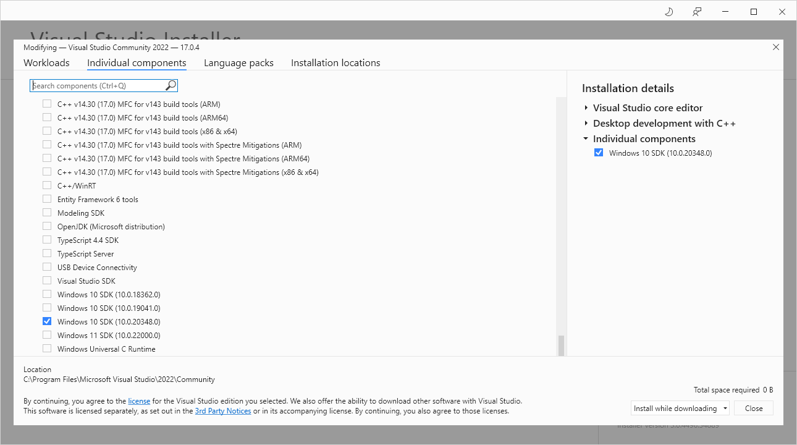

# MSU sMDT Dark Current Control Software
Welcome to the MSU sMDT Dark Current Control Software (MSU-SMDT-DCCS) GitHub repository. This is where we host the 
program that controls our Dark Current Testing Station. The purpose of this program specifically is to interface with 
our CAEN DT1471HET Power Supply Unit (PSU), as well as our Dark Current Control Hardware (DCCH) board, in order to 
automate our testing.

As such, this program's main goals are as follows:
1. To offer an easy-to-use and intuitive Graphical User Interface (GUI)
2. To have a readable, complete, and extensive codebase 
3. To place the control software under version control with Git

This program is written in C++ and utilizes a various assortment of external libraries such as the 
[Qt][] framework, as well as other libraries meant to either aid development or aid the 
stability of the program.

This program was designed specifically for our PSU model. As well, this program was designed specifically for
Windows 10. Thus, our use-case is very specific, and the code will reflect that. 

In order to encourage a maintainable and stable codebase, we will try to incorporate the principles of modern C++, 
such as: smart pointers, the STL container library, the RAII paradigm, etc. 

[Qt]: https://www.qt.io/


## Setting Up The Development Environment
### Revised
The original project utilized Vcpkg in order to install dependencies. This method brought with it many issues that 
proved time consuming to fix. Furthermore, it was not possible to use a pre-installed version of Qt alongside
the installed Vcpkg packages. In light of this, the build system was updated to no longer require Vcpkg. The new 
build system requires an up-to-date installation of CMake, as well as Git. 

### Obtaining Visual Studio 2022 and MSVC
First things first, we need a C++ compiler. As we are on Windows, we will opt to use MSVC.

Install [Visual Studio Community 2022][VS]. When in the installer, choose the *Desktop development with C++* option, 
as shown below. 



As well, opt for the Windows 10 SDK shown below, which can be found in the *Individual components* tab.




## Installing Qt
The Qt Libraries can be found [here](https://www.qt.io/download). An account will be needed in order to download and
install the Qt Libraries. As well, we will be opting for the open source installation, which will install Qt as a 
shared library.

## Installing the CAEN HV Wrapper Library
The CAEN HV Wrapper Library download can be found [here][hv-wrapper]. The project assumes that it will be installed 
in the directory `C:\Program Files\CAEN\HV\CAENHVWrapper`, which happens to be the default location.

[hv-wrapper]: https://www.caen.it/products/caen-hv-wrapper-library/

### A Virtual Interface to the PSU
This project can be build without the CAEN HV Wrapper Library. See the `CMakeLists.txt` file for the option to build
with a virtual interface. 


## Building The Project
The location of the Qt Libraries can be input at the command line. To edit the location of the CAEN HV Wrapper
Library, see the `cmake/FindCAENHVWrapper.cmake` file. 

To build the project, execute the following commands

```cmd
> mkdir build
> cmake -B build -S .
    -DCMAKE_PREFIX_PATH=[path to /Qt/6.3.0/msvc2019_64]
    -DCMAKE_WINDOWS_EXPORT_ALL_SYMBOLS=TRUE 
    -DSPDLOG_FMT_EXTERNAL=ON 
    -DCMAKE_BUILD_TYPE=DEBUG 
> cmake --build build
> ./build/Debug/dccs.exe
```

## Documentation
Further documentation on the project can be found as the markdown document
`documentation/documentation.md`.