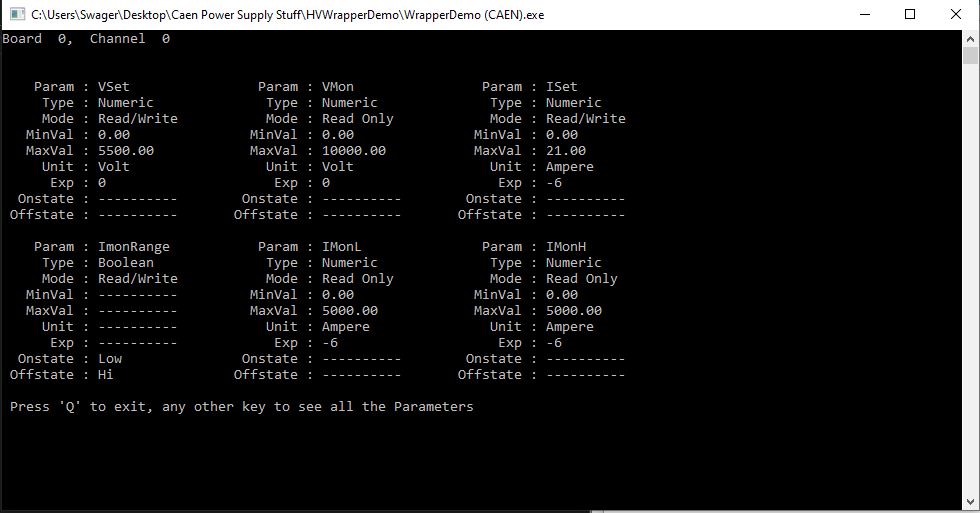
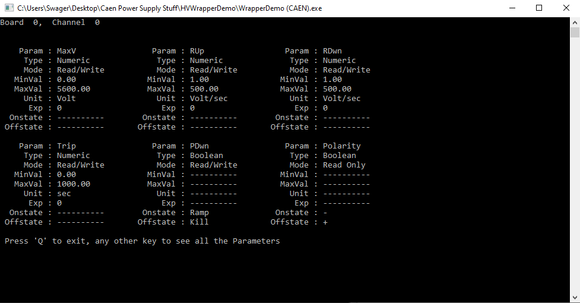
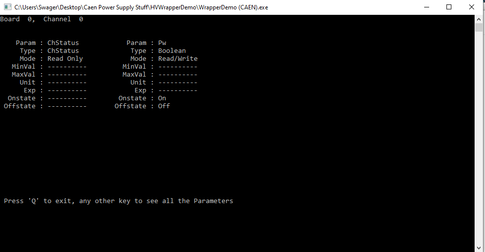
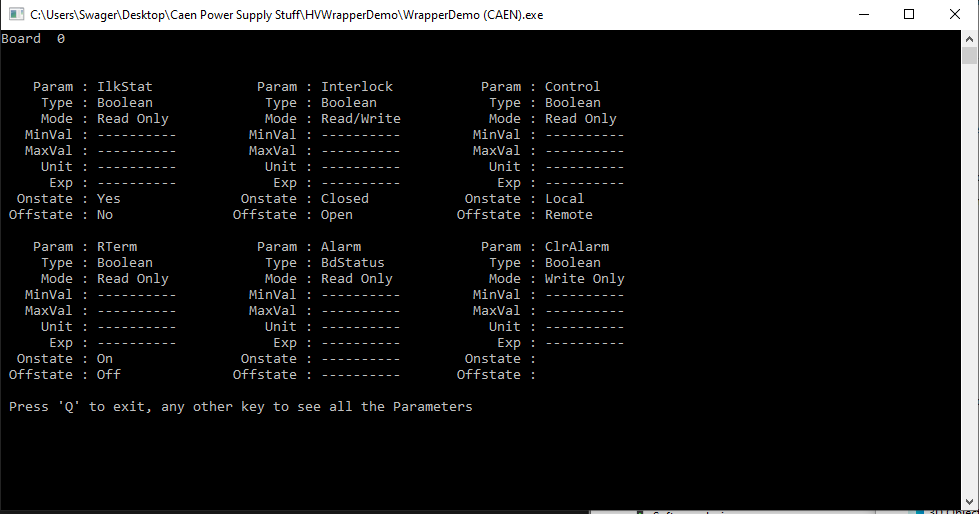
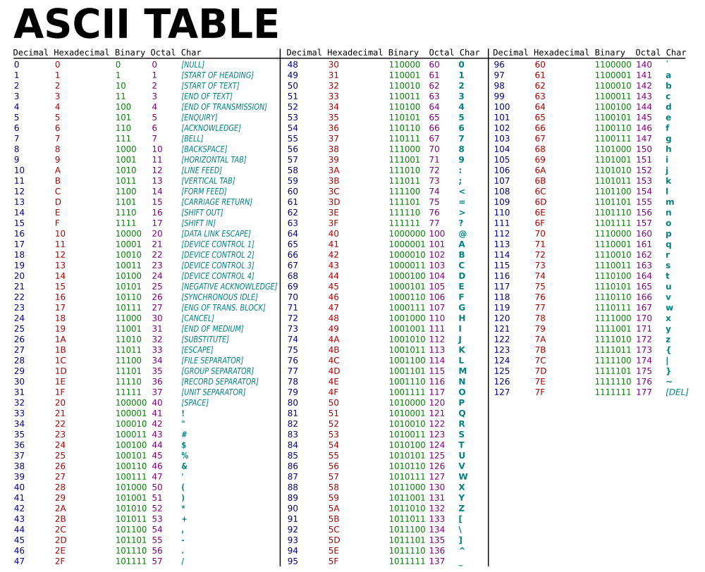

```Markdown
# Title
## Chapter
### Section
#### Subsection
```

# Documentation
### Welcome
Welcome to the MSU sMDT Dark Current Control Software (DCCS) documentation. This
documentation was created to help document and explain the design of the DCCS
program, as well as some of the more obscure portions of the code.

### Purpose of the DCCS Program
The DCCS Program was created to automate the Dark Current Station with a simple,
easy to use, intuitive, and well documented program that can be readily built
for any computer. The program is written in C++, hosted on GitHub, and has
instructions for the building progress.

### Why C++?
The C++ language is a popular and powerful language which can handle GUI
development. The C++ language also offers a lot of high level constructs such
as classes, while offering performant code. 

In this project, we seek to use modern C++, so that the code can be safe as well
as fast. 

### Building The Project
To build the project, you will need C++ on the computer. You are free to use any
C++ compiler that supports C++23, although you can potentially relax that 
constraint to C++17 with a few modifications to the code. The compiler will
likely offer a warning. 

You will also need the [Qt](https://www.qt.io/) libraries to be installed on
the computer. These take the form of a dynamically-linked library. 

Lastly, you will need the CAEN HV Wrapper Library, which can be
found [here](https://www.caen.it/products/caen-hv-wrapper-library/). The project
assumes that it will be installed in the  directory 
`C:\Program Files\CAEN\HV\CAENHVWrapper`, which happens to be the default 
install location.

It should be noted that the project can be built without the CAEN HV Wrapper
Library. However, for actual lab use, the HV Library is required.

Before building the library, please consult the root `CMakeLists.txt` file in
the root directory. This file houses the *hardcoded* path to the Qt libraries,
as well as a few other options. Of note are the following:

Ensure that the `VIRTUALIZE_HVLIB` option is set to `OFF`.
```CMake
# A few variables that we can set based on how we want to compile everything.
option(VIRTUALIZE_HVLIB "Virtualize the connection to the CAEN HV Wrapper Library (HVLIB)" OFF)
option(TEST_FAKEHV "Check testing of the FakeHV Library" OFF)
```

Secondly, add in the Qt path:
```CMake
if (MSVC)
    list(APPEND CMAKE_PREFIX_PATH /path/to/qt)
```

If the path to the CAEN HV Wrapper library is different, please refer
to the `cmake/FindCAENHVWrapper.cmake` file to adjust the location of the
library. Notably, the two paths are in the `find_library()` and `find_path()`
functions:
```CMake
find_library(
    CAENHVWrapper_LIBRARY
    NAMES CAENHVWrapper
    PATHS "C:/Program Files/CAEN/HV/CAENHVWrapper"
    PATH_SUFFIXES "lib/x86_64/"
    DOC "The CAEN HV Wrapper Library"
    REQUIRED
)

find_path(
    CAENHVWrapper_INCLUDE_DIR
    NAMES "CAENHVWrapper.h"
    PATHS "C:/Program Files/CAEN/HV/CAENHVWrapper"
    PATH_SUFFIXES "include/"
    DOC "The header file for the CAEN HV Wrapper Library"
    REQUIRED
)
```

To build the project, execute the following commands:
```cmd
> mkdir build
> cmake -B build -S .
    -DCMAKE_WINDOWS_EXPORT_ALL_SYMBOLS=TRUE 
    -DCMAKE_BUILD_TYPE=DEBUG 
> cmake --build build
```

To add the Qt DLL files, execute the following command:
```cmd
> [path/to/qt]/[version]/[compiler]/bin/windeployqt.exe [path/to/executable]
```

For the lab computer, this takes the form:
```cmd
> C:/Qt/6.3.1/msvc2019_64/bin/windeployqt.exe build/Debug/dccs.exe
```

Now the executable itself can be ran:
```cmd
> ./build/Debug/dccs.exe
```

## Chapter 1: Outline of the Project
### The Components of the Project
The root directory has the following folders:
- `cmake`: Files related to the CAEN HV Wrapper Library and other libraries
- `documentation`: Files related to the documentation of code
- `licenses`: Licenses for any external libraries
- `source`: The actual source code

### The Source Folder
Inside the source folder, there are three folders:
- `external`: The location of the default configuration file
- `gui`: The source code for the GUI components of the program (those that use
qt)
- `psu`: The code related to the interfacing with the Lab power supply
- `test`: Deprecated code that was used to test `psu` code

## Chapter 2: The Build System
### Overview
The build system uses [CMake](https://cmake.org/) in order to standardize the
build process. Without CMake, the process of hand building the source code and
linking the object files would be very tedious. As well, there would be
differing build instructions for differing platforms. While not a concern for
a program that is already built, this constraint greatly hinders further 
improvements to the code. 

### Using CMake
The build instructions thus far have assumed that you'll be building from the
command line. However, CMake does offer a GUI based interface, which can
simplify certain portions of the build process. Whether the CLI version of CMake
or the GUI version is used is of little consequence to the program itself.

### FetchContent
In order to allow for the greatest flexibility with external libraries, the
build system uses the FetchContent CMake utility. Including a library such as
[fmt](https://github.com/fmtlib/fmt) is simple:
```CMake
include(FetchContent)
FetchContent_Declare(
    fmt
    GIT_REPOSITORY https://github.com/fmtlib/fmt.git
    GIT_TAG master
)
FetchContent_MakeAvailable(fmt)
```

The libraries that the program uses can be found in the root `CMakeLists.txt`
file.

### Virtualizing with the FakeHV Library
During testing and development, the CAEN HV Wrapper Library can be virtualized
so that the developer does not require an actual power supply to be on hand. As
this virtualized version of the HV Library is meant to be a drop-in replacement,
it is written in C. As such, you will want to have a C compiler on hand.
The MSVC and Clang compilers offer the ability to build both C++ and C, with the
latter having `clang++` and `clang` options at the ready. It should be noted 
that the root `CMakeLists.txt` file has the requirement of C11, although an
earlier version of C can be used. 

With a virtualized HV Library, herein referred to as the FakeHV Library, this
allows the developer to work on a truly platform independent code base. The 
code can be freely compiled on MacOS, Windows, and Linux -- despite the CAEN HV
Wrapper Library only being available on the Windows and Linux platforms 
(although the Linux version has not been tested).

#### Bugs with the FakeHV Library
When compiling wit the FakeHV Library, the compiler will sometimes complain 
about uninitialized variables. This is the result of the test program found in
the `source/psu/FakeHV/main.c` file, which has a few sanity checks. The actual
code can be found in the `FakeHVLibrary.c` and `FakeHVLibrary.h` files.

For the `FakeHVLibrary.c`, it was created to most resemble the CAEN HV Wrapper
Library's interface, which can be found 
[here](https://www.caen.it/products/caen-hv-wrapper-library/). As such, there
are pieces of code such as 
```C
if (numberOfSlots == NULL)
{
    FakeHV_ErrorCode = FAKEHV_BAD_REFERENCE;
    return -1;
}
```
which are meant to capture the intended use case. As such, the intent is that
the state of the program is always valid during execution. However, this can
have some odd consequences. There have been bugs, wherein an error was caught
with a bad handle, despite no obvious reason for there to be a bad handle. This
is a bug, and its source has not been determined. 

### The CMakeLists File
There is the root `CMakeLists.txt` file, which houses the main build logic. In
the subdirectories, there is a `CMakeLists.txt` file which houses the logic on
how to build the components within these files.

In the `source/psu` folder, we create an **OBJECT** library, which allows us to
package up all of the code into a single object. We can then link the packages
that the object will need. The object is then exported to the main 
`CMakeLists.txt` when we perform the `add_subdirectory()` CMake command.

In the `source/gui` folder, we simply use the `target_sources()` CMake command,
as this code is what forms the program itself. As we are adding source files
to the main target itself, which is the `dccs` target, we do not need to worry
about linking libraries -- so long as we eventually link the libraries together
somewhere in the root `CMakeLists.txt` file.

Whenever we want to extend the functionality of the program by adding new GUI
components, we can simply add the *header* and *source* files to the 
`source/gui/CMakeLists.txt` file, and it should automatically compile and link
everything together. 

## Chapter 3: The Power Supply
### The CAEN HV Wrapper Library and the HVInterface Class
Seeing as the CAEN HV Wrapper Library (and the FakeHV Library) is written in C,
we will need an interface so that we can use it in C++. In reality, we could
use the code directly (as the interop between C and C++ is well defined).
However, this would mean managing memory ourselves, and dealing with pointers
all over the place. In reality, we just want to have an object that we can use
to interface with the power supply. This is where the `HVInterface` library
comes in.

This library is meant to encapsulate the C code into a C++ wrapper, which allows
for a unified API, on which we can interface with the power supply. Looking at
the code, you'll notice that we have a preprocessor directive which helps us
go from `CAENHV_GetChParam()` or `FakeHV_GetChannelParameter()` to a much
simpler `GetChannelParameter()` function call. This is so that we do not need
the constant `ifdef, else, endif` preprocessor conditionals. The code also uses
a few `static` functions, which help hide some of the clutter from the API.

### Dealing with Errors
Perusing through the code, you will notice that any potential error is 
propagated by throwing exceptions. This is because there really isn't a way to
notify the user of the code without throwing errors. Any kind of error in the
code is erroneous, as the program should *ideally* never be in a state that 
would cause an error.

Most errors caught from the HVInterface are programmer errors (i.e. the 
programmer asked for the wrong parameter name). However, some errors, such as 
the inability to connect to the power supply, are user errors -- as such, the
HVInterface class needs a way to communicate with the GUI components without
itself being a GUI component; hence, the use of exceptions. 

### HVInterface and the PSUController Class
The `HVInterface` class provides us with a unified API, which we can use to
interact with the power supply. However, we will still need to know things such
as the parameter names (e.g. VSet), and other facets of the power supply that
are simply implementation details. As such, we abstract away the power supply
and its connections with the `PSUController` class. This class takes care of 
connected with the power supply, disconnecting, and accessing the known 
parameters, by abstracting the entire ordeal into a `PSUController` object. 

In the source code of this class, you'll find things such as maximum and
minimum values for certain parameters. These were obtained with the
`WrapperDemo` program, which can be found in the CAEN HV Wrapper Library files.
Screenshots of the outputs of this program can be found in the `documentation`
folder.

Notably, the attributes of the different parameters, as well as a list of all
of the available parameters can be found in the following screenshots:






The attributes of the board parameters, which are distinctly different from the
channel parameters, can be found in the following screenshot:


The difference between a board parameter and a channel parameter is that a 
channel parameter is channel specific (i.e. the VSet on CH0 does not affect the
VSet on CH2), whereas the board parameters affect all channels (there is only
one board on the DT1471HET Power Supply).

### Propagation of Errors
It is notable that the `HVInterface` and the `PSUController` both propagate 
errors by throwing them. As such, any code that uses either will be required
to have a `catch (std::exception& ex)` clause somewhere. As all these errors are
of the type `std::runtime_error`, they will be easy to catch.

The empty `throw` clauses are so that the PSUController catches the error, logs
it, and then re-throws it out. This is done so that a more clear path can be
created, which helps with debugging.

## Chapter 4: The Microcontroller Software
The microcontroller code can be found in the `source/external/DCCH` folder. The
Microcontroller is a [Teensy 2.0](https://www.pjrc.com/store/teensy.html) board,
which is programmed using a modified Arduino program, known as 
[Teensyduino](https://www.pjrc.com/teensy/teensyduino.html). 

### The DCCH Folder
Firstly, it should be noted that the Arduino program is very specific to the
directory of the file and the name of the file. As such, the `DCCH.ino` file is
in the `DCCH` folder (notice the same name).

### The Use of Constexpr
The DCCH program uses some features from C++17 and later, such as the following:
```C++
uint8_t convertCharToInt(const char input)
{
    if constexpr (CompileConditional::INTERACTIVE)
        return (uint8_t) (input - Sequence::ZERO_CHAR);
    else
        return (uint8_t) input;
}
```

The purpose of the `if constepxr` is to have the ability to use compile time
conditionals without the `#ifdef` preprocessor nonsense. However, this presents
a unique problem: as of the time that this document is being written, the 
Arduino libraries are compiled with C++11. However, this feature is only
available on C++17 and later (really, you'll want at least C++20). This means
that we'll need to modify which C++ the Arduino code uses.

So far, the program has only ever been compiled and then loaded onto the
microcontroller on MacOS. This required an edit to the 
`/Applications/Teensyduino.app/Contents/Java/hardware/teensy/avr/boards.txt`
file, where we changed `-std=gnu++11` to `-std=gnu++17` on line 1684, as 
show below:

```
teensy2.build.flags.cpp=-fno-exceptions -fpermissive -felide-constructors -std=gnu++17
```

The precise location of this file differs with each platform, and the precise
mechanism for Windows is as-of-yet-unknown.

### The Interactive Mode
During development, the need to have an interactive mode was apparent. This
meant allowing the ability to connect to the microcontroller through serial, and
issue individual commands through the keyboard. Naturally, this leads to the
following question: isn't the program *already* interactive. The answer is,
well, yes. However, the program does not give any response as to whether a 
command was received. 

As well, it becomes hard to type the `0x00` character through the keyboard, 
as the ascii character is `NULL`, as shown in the ASCII table below:


As it stands, the Arduino code reads in an 8-bit integer as a character. We can
convert the character received so that we can address the 0th tube by using an
offset. That is, we define the `SPACE` character to be our 0th character, which
corresponds to the hexadecimal number `0x20`. We can define the zero character
in the following namespace:
```C++
namespace Sequence
{
    constexpr char ZERO_CHAR { ' ' };    
    constexpr char NULL_CHAR = 0;

    constexpr char START = '{';
    constexpr char STOP  = '}';
    constexpr char DELIM = '|';
    constexpr char RESET = '~';    
}
```

The use of the `if constexpr ()` conditional is to allow for any changes to the
zero character to be propagated, all at once. So we can change the zero
character through editing a single line. 

### Changing The Number of Addressable Tubes
We can change things such as the total number of tubes that are in a single
test by changing that variable in the namespace:
```C++
namespace Test
{
    constexpr int TUBES { 32 };
    constexpr int BOARDS { TUBES / Board::POSITIONS_PER_BOARD };
}
```

You'll notice that the number of boards is calculated based on the number of
tubes. The number of positions per board is constant, as this is a physical
limitation. 

Each board has 8 channels connected to it, CH0 to CH7. However, we sometimes
refer to these physical channels instead as positions. This helps disambiguate
terms.

## Chapter 5: The Graphical User Interface
### Structure of the Program
The Qt documentation can be found [here](https://doc.qt.io/qt.html). 

When building a GUI, we model each of the parts of the GUI as a single object.
We can subclass already made Qt components which best describe the type of 
object we need. We can subclass these Qt components to add functionality,
such as keeping track of a state, or even overhauling the object to allow for
custom data types.

The very start of the program is the root `main.cpp` folder, which simply houses
the start of our program. The main GUI object is the `MainWindow` object, which
can be found with the rest of the GUI code in the `source/gui` folder. We can
then include the objects that we need, whenever we need them, through the
`#include` preprocessor directive. 

The `MainWindow` object is composed of the `DCCHController` object, the 
`TestController` object, the `ChannelWidget` object, the `TestStatusWidget`,
and the `ControlPanelWidget`. Each of these objects are themselves composed of
objects. 

In essence, the purpose of the composite objects is encapsulation. We wrap up
individual objects into a composite object, which can then allow us to 
compartmentalize the layout. We can add a group of buttons together, form them
into a layout, and then code as though there is a single button group. 

Whenever one object is composed within the other object, we will use the term
of parent to child. For communications where the child wishes to relay
information to the child, this can be done in a direct manner with return values
or some other direct method. For when the parent needs to pass information to
the child, this can be done by passing arguments.

However, when a child needs to speak to another child (i.e. a button needs to
pass a state to some object), we can use the signals/slots method. What happens
is when the signal and slot are connected, this acts as a relay, which allows
for one signal to trigger a particular slot.

The connection of one child's signal to another child's slot is done by the
parent, so the parent will need to own the child.

### Signals and Slots
A signal is a function which is generated by the Qt MOC system. In essence, a
function can `emit` a signal. This signal can then be captured by any number of
connected slots. Think of it like a flag. When the signal flag is thrown, any
number of observers can then execute a function after capturing the flag. We can
use this to pass information such as an event taking place, or we can even use
it to pass around data to other objects.

More information can be found 
[here](https://doc.qt.io/qt-6/signalsandslots.html).

### Ownership
We should take a detour to discuss ownership. You'll notice that whenever we
deal with Qt objects, we use the `new` keyword as well as pointers. Normally,
this is something that we absolutely have to keep an eye out for. However, in
Qt, we can simply allow the system to handle much of the memory management.

Whenever a parent is created with children, the children can belong to the
parent. So, we can dynamically allocate the children, and then assign a parent
to manage the child. So long as the parent is managed, the children will be
managed as well. Should the parent be freed, the children will then also be
freed. This allows for a much cleaner way of dealing with memory management. 

However, some parents will need to be manually managed. In these situations, we
can use a smart pointer, especially one like a `std::shared_ptr`, which will
allow the object to be freed when it is no longer required. 

### The DCCHController
Now back to the scheduled program. The `DCCHController` is the object that is
responsible with communicating with the microcontroller. The connection
information is stored in the `configuration.json` file, with a default
configuration file found in the `source/external` directory. 

This object houses the specific information related the microcontroller, such
as the actual character string to be passed out. This information is abstracted
away into two functions: `connectTube()` and `disconnectTube()`. This class can 
be extended to allow for greater functionality.

It should be noted that there can only be one instance of the `DCCHController`
at one time, as Serial Ports are exclusive items.

**BUG**. On Windows, the `QSerialPort` class appears to not work. There is some
weird nonsense going on in the background. The code uses a workaround by
using the Win32 API directly. The `QSerialPort` class appears to work on other
platforms, but more testing is needed to confirm this. The `#ifdef Q_OS_WIN` 
preprocessor flag is used to check whether the OS is Windows, provided that the
object has already including Qt code (such as headers). Essentially, the
preprocessor variable needs to already be defined. The signature of the
`DCCHController` constructor changes as well (there is no QObject parent).

### The TestController
The `TestController` object houses all of the logic for the actual testing
of the Dark Current program. This class holds the `Test` object, which houses
a function for the actual testing procedure. This object is different from the
`TestController` for one specific reason: we want the test to live in a
different thread.

In order to accomplish this, we need to create a new `QThread`. We can then
attach the `Test` object to this `QThread`, as shown through the 
`TestController::createNewTest()` function. We can then connect all of the
signals and slots. We need to use the signal/slot method as this method should
be thread-safe. 

#### The Lambda Function
We don't necessarily need to connect a signal to just a slot. We can actually
capture the signal and use an anonymous function (aka a lambda function). This
is very useful when we need to capture a signal only to re-emit it out to some
other object (for encapsulation purposes). 

The `MainWindow` object does not need to know that the actual testing logic
lives in a separate thread. So we can anonymously capture the signals from the
separate thread, and them re-emit them out.

### The ControlPanelWidget
This object is used to encapsulate the command buttons for the test into a 
singular object.

### The ChannelWidget
The `ChannelWidget` is used to hold the status and the table of tubes within a
singular widget. As such, this is a composite widget.

#### The CollectionModel
This is where we separate the data from its representation. For the
`ChannelWidget`, we use a simple `QTreeView`. However, in order to actually
store the data, we use the `CollectionModel`. This object offers an API for
accessing the underlying data without necessarily knowing how the data is
stored. 

The benefit is that we can use the rather generic `QTreeView` for our custom
data, which allows for custom commands (e.g. disallowing the ability to edit the
current or the voltage).

#### The Barcode Scanner
**Current Limitation**: We need the scanner to have a `CR+LF` line ending, as
well as appending a `DOWN ARROW` after scanning. This is different based on the
barcode scanner model.

**Idea**: We might be able to implement a filter, which can check for the `TAB`
character, which can then automatically enter to the next row, but in the same
column.

### The TestStatusWidget
This is where test specific information lies, such as the time or the connection
status.

## Chapter 6: The Test Itself
### Emitting The Data
In order to send the data, which is collected from the power supply, to the
widgets that live in the main GUI thread, we need to use the signals/slot
methods.

Here is the data path:
1.  The `Test` object emits a signal for the data
2.  The `TestController` captures this signal and re-emits it out
3.  The `MainController` captures this signal, and then sets the data
explicitly within the `CollectionModel`

It is important to trace this signal path, as this will allow some of the names
to make sense: we allow for the same names as they are identical signals; we
chain signals together using lambda functions.

## Chapter 7: Testing Framework
TO BE IMPLEMENTED.

## Appendices
### A-1: Bugs
**BUG 1**: The command buttons do not work as intended. When starting a test,
and then using the stop button, and then re-starting the test, the button does
not change text from `START` to `STOP`.

**BUG 2**: Time Elapsed says `1:5 min` instead of `1:05 min`. This just requires
the formatting to change to allow for a leading 0.

**BUG 3**: Time remaining is not every second. We should create a `QTimer` which
connects to an emit function, so we can truly emit every second.

**BUG 4 [FATAL]**: The test does not stop if the microcontroller is
disconnected. The test should stop and immediately alert the user.

### A-2: Wanted Features
**FEATURE 1**: We do not alert if there is a need to physically toggle a switch.
We should emit a signal for status upon connecting

**FEATURE 2**: SEPARATE PROGRAM FOR REVERSE. NO SCAN. STATUS. NO READ

**FEATURE 3**: POTENTIAL SOUND FOR COMPLETE TEST

**FEATURE 4**: SHOW CURRENT/VOLTAGE instead of TubeDisplay

**FEATURE 5**: Add the intrinsic current to the channel GroupBox title
- The function `ChannelWidget::receiveIntrinsicCurrent(float)` exists, it is
just not connected to anything. The `Test` object will need to emit a new
signal.

### A-3: Historic Bugs
#### Why Shorts and Floats?
It should be noted that, as the project interfaces with C code, we should be 
mindful of C data types. As the library uses the `short` and `float` data type, 
we conform to this by using that same data type in C++. While we ought to be
able to promote these data types to `int` and `double`, there were quite a few 
problems with the bookkeeping of these promoted types. Therefore, we simply pass
the `short` and `float` as-is. Given the precision of the data, we expect these 
data types to be sufficient.

#### CAEN HV Wrapper
This wrapper has introduced many bugs. Bug among the most annoying is the 
following: the library itself must define a whole bunch of types, macros, and 
similar items. This was one of the most confusing bugs to identify due to its
relative obscurity. However, the following bug exists: if the CAEN HV Wrapper 
Library (HVLIB) is included before **any** Qt Libraries, the compiler will 
complain with seemingly nonsensical errors: 
`'char' followed by 'char' is illegal` and whatnot. The source of the errors is 
that the HVLIB defines a whole bunch of things that Qt defines. Due to this, 
the HVLIB *must be the last library included* in order for the program to 
compile. However, it is not known what kinds of bugs this might introduce down 
the line.


### USER MANUAL
- If the switch was off during testing, stop the test and flip the switch